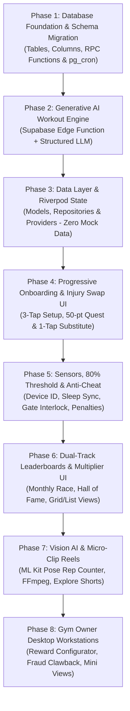

# 🚀 GymConnect Enterprise SaaS — Gamification, AI & Anti-Cheat Phased Execution Plan

> **Document Version:** 1.0 (Execution Roadmap)  
> **Status:** Implementation Guide (Part-by-Part, Starting from Database)  
> **Core Architecture:** Multi-Tenant Supabase (PostgreSQL + RLS + pg_cron), Flutter Mobile (Riverpod + ML Kit + Health Sensors), Flutter Desktop (Admin & Workstations)  
> **Master Reference:** [GAMIFICATION_SAAS_MASTER_PLAN.md](file:///d:/gym/GAMIFICATION_SAAS_MASTER_PLAN.md)

---

## 🗺️ High-Level Phased Execution Overview

Ham is pooray architecture ko 8 sequential phases mein develop karenge. Har phase ka agle phase ke sath strictly defined contract aur database backing hogi (Zero Mock Data standard).

---

## 🗄️ Phase 1: Database Foundation & Schema Migration (The SQL Core)
> **Primary File:** `supabase/migrations/20260928000000_gamification_ai_and_anticheat_core.sql`  
> **Goal:** Supabase database ko 100% production-ready banana taake frontend development ke waqt kisi table, column ya RPC function ki kami na rahay.

### 📌 Step 1.1: Extensions & Multi-Tenant Schema Alterations (DDL Delta)
*   **Extensions Setup (Very First Line):**
    *   `CREATE EXTENSION IF NOT EXISTS pg_cron;` (Safeguarded with try-catch block so cron functions never crash on migration run).
*   **`tenants` table (JSONB Null-Safety Enforced):**
    *   `leaderboard_rewards JSONB NOT NULL DEFAULT '{"rank_1": {"title": "1-Month Free Access", "type": "membership_extension", "value": 30}, "rank_2": {"title": "50% Off Next Renewal", "type": "discount_voucher", "value": 50}, "rank_3": {"title": "Free Whey Shaker & Tub", "type": "custom_reward", "value": "merch"}}'::jsonb` (Strictly `NOT NULL` to eliminate Flutter runtime null-pointer red screens).
    *   `min_monthly_workouts_qualification INT DEFAULT 18` (Eligibility threshold).
    *   `veteran_multiplier_config JSONB NOT NULL DEFAULT '{"tier_1_days": 14, "tier_1_multiplier": 1.10, "tier_2_days": 30, "tier_2_multiplier": 1.25, "tier_3_days": 60, "tier_3_multiplier": 1.50}'::jsonb`.
*   **`profiles` table:**
    *   `primary_device_id VARCHAR(255)` (Hardware UUID lock).
    *   `device_locked_at TIMESTAMPTZ`.
    *   `device_model_info VARCHAR(150)`.
*   **`user_fitness_profiles` table (Track A/B Routing Column Added):**
    *   `assigned_workout_track VARCHAR(50) DEFAULT 'track_a' CHECK (assigned_workout_track IN ('track_a', 'track_b'))` (Persists Track A Dynamic vs Track B Low-Impact Beginner decision).
    *   `current_step_target INT DEFAULT 10000`.
    *   `base_step_target INT DEFAULT 10000`.
    *   `consecutive_target_misses INT DEFAULT 0`.
    *   `last_auto_calibrated_at TIMESTAMPTZ`.
    *   `medical_injuries TEXT[] DEFAULT '{}'`.
    *   `profile_completed BOOLEAN DEFAULT FALSE`.
*   **`exercises` table:**
    *   `contraindicated_injuries TEXT[] DEFAULT '{}'`.
    *   `swap_group_id VARCHAR(100)`.
    *   `ml_pose_exercise_type VARCHAR(50)` (`squat`, `pushup`, `bicep_curl`, `pullup`).
*   **`member_gamification` table:**
    *   `monthly_points INT DEFAULT 0`.
    *   `monthly_workouts_completed INT DEFAULT 0`.
    *   `streak_multiplier NUMERIC(3, 2) DEFAULT 1.00`.
    *   `is_elite_qualified BOOLEAN DEFAULT FALSE`.
    *   `total_penalties_count INT DEFAULT 0`.
    *   `last_penalty_date DATE`.

### 📌 Step 1.2: New Database Tables
1.  **`daily_gamification_logs`:**
    *   Daily composite audit table tracking workout completion %, step count, sleep hours, sleep source (`healthkit`, `health_connect`, `manual`), diet proof type (`photo_proof`, `self_check`), gate check-in status, points awarded, and unexcused penalty flag.
2.  **`member_workout_reels`:**
    *   Table for 60–90 second stitched workout video reels, thumbnails, member streak badge at recording time, explore feed visibility, and like counter.
3.  **`monthly_leaderboard_archives`:**
    *   Historical podium records for each month, reward title, reward type, automated fulfillment tracking (`is_fulfilled = TRUE`), extended subscription ID, and generated Rs. 0 invoice reference.
4.  **`gamification_flagged_queue`:**
    *   Workstation queue for gym owners to audit suspicious meal photos or manual step entries and claw back fraudulent points.

### 📌 Step 1.3: PostgreSQL RPC Functions & Automated Logic
*   **`rpc_submit_daily_activity()`:** Atomic function that computes weighted points (+50 workout, +20 auto-steps, +15 diet proof, +10 sleep), evaluates the 80% composite threshold, verifies physical gate scan in `attendance_logs`, and increments streak.
*   **`rpc_daily_midnight_audit()`:** Automated pg_cron job running at 11:59 PM. Evaluates active members who missed gym. Shields members with approved freezes in `member_subscriptions` (`status = 'frozen'` or within `freeze_start_date` to `freeze_end_date`). Applies **-10 points penalty** and resets streak for unexcused absences.
*   **`rpc_monthly_leaderboard_reset()`:** Automated pg_cron job running on the 1st of every month at 00:00:00 UTC. Evaluates qualified Top 3 members, **automatically extends `member_subscriptions` by 30 days**, generates Rs. 0 reconciliation invoice in `invoices`, resets `monthly_points = 0`, and calculates veteran `streak_multiplier`.

---

## ⚡ Phase 2: Static Master Template Engine & Injury Sanitizer (Zero LLM) - [STATUS: 100% COMPLETE]
> **Primary File:** `supabase/migrations/20260929000000_ai_workout_engine_backend.sql` & `supabase/functions/generate-ai-workout/index.ts`  
> **Goal:** High-performance, zero-cost static master template engine with silent BMI calculation, Track A vs Track B routing, and automatic SQL exercise substitution for injuries via `swap_group_id`.

### 📌 Step 2.1: Supabase Static Master Template Architecture - [COMPLETE]
*   **Static Master 90-Day Protocols (Track A & Track B):** Pre-existing master protocols defined in PostgreSQL database (`workout_routines` where `user_id IS NULL`).
    *   **Track A:** `Master 90-Day Dynamic Progressive Protocol (Track A)` (Hypertrophy & compound progressive overload).
    *   **Track B:** `Master 90-Day Low-Impact Foundation (Track B)` (Joint-friendly machine & stability focus for overweight members and beginners to eliminate soreness and churn).
*   Zero LLM/OpenAI dependency: Eliminates API fees, tokens, rate limits, and risk of hallucinations.

### 📌 Step 2.2: Silent BMI Routing & SQL `swap_group_id` Substitution - [COMPLETE]
*   **Silent BMI & Overweight Routing (Track A vs Track B):**
    - Computes silent BMI: $BMI = \frac{\text{Weight (kg)}}{(\text{Height (m)})^2}$.
    - If user is overweight/obese ($\text{Weight} \ge 90\text{kg}$ or $BMI \ge 28.0$ with beginner status, or $\text{Age} \ge 55$), system automatically routes to **Track B (Low-Impact Beginner Foundation)**.
    - Otherwise assigns **Track A (Dynamic Progressive Overload)**.
*   **Automatic SQL Medical Injury Swap via `swap_group_id`:**
    - For each exercise in the assigned master template, checks if `exercises.contraindicated_injuries && user.medical_injuries`.
    - If contraindicated, performs a SQL query to swap out the exercise with a safe alternative from the same `swap_group_id` (or matching muscle group) that has no contraindications and is safe for the track.
    - Records personalized substitution notes (e.g. *"Substituted from Barbell Back Squat to protect knee."*).

### 📌 Step 2.3: Atomic Database RPC & Full-Stack Integration - [COMPLETE]
*   **RPC:** `rpc_assign_master_workout_template()` executes the entire workflow atomically:
    - Calculates BMI and track routing.
    - Locates master template (Gym custom or Platform default).
    - Clones routine and routine days into user-specific personalized routine.
    - Applies `swap_group_id` substitutions for all exercises.
    - Binds routine to `user_fitness_profiles.current_workout_routine_id`.
    - Returns structured JSON response (`routine_id`, `master_template_id`, `assigned_track`, `swapped_exercises_count`, `bmi`, etc.).
*   **Delivered Vertical Slice:**
    - [supabase/functions/generate-ai-workout/index.ts](file:///d:/gym/supabase/functions/generate-ai-workout/index.ts): Lean Edge Function calling `rpc_assign_master_workout_template` with zero external LLM dependencies.
    - [AiWorkoutRepository](file:///d:/gym/gym_connect_app/lib/features/workout/data/ai_workout_repository.dart): Direct PostgreSQL RPC execution with Edge Function fallback.
    - [aiWorkoutProvider](file:///d:/gym/gym_connect_app/lib/features/workout/presentation/providers/ai_workout_provider.dart): Riverpod state notifier.
    - [AiWorkoutSynthesizerSheet](file:///d:/gym/gym_connect_app/lib/features/workout/presentation/widgets/ai_workout_synthesizer_sheet.dart): UI sheet under 150 lines.
    - [ExerciseSwapSheet](file:///d:/gym/gym_connect_app/lib/features/workout/presentation/widgets/exercise_swap_sheet.dart): 1-Tap zero-penalty manual exercise swap in [ActiveWorkoutScreen](file:///d:/gym/gym_connect_app/lib/features/workout/presentation/active_workout_screen.dart).
    - Unit & Widget test suite: [ai_workout_engine_test.dart](file:///d:/gym/gym_connect_app/test/ai_workout_engine_test.dart) (100% passing).

---

## 📦 Phase 3: Data Layer, Repositories & Riverpod Providers - [STATUS: 100% COMPLETE]
> **Goal:** Flutter clean architecture models, repositories aur state providers banana (Zero Mock Data standard).

### 📌 Step 3.1: Domain Models - [COMPLETE]
*   [DailyGamificationLog](file:///d:/gym/gym_connect_app/lib/features/gamification/domain/models/daily_gamification_log.dart): 80% composite task audit log, sensor types, penalty tracking.
*   [LeaderboardMember](file:///d:/gym/gym_connect_app/lib/features/gamification/domain/models/leaderboard_member.dart): Monthly points, lifetime streaks, podium rank, veteran multiplier badges, qualification status.
*   [WorkoutMicroReel](file:///d:/gym/gym_connect_app/lib/features/gamification/domain/models/workout_micro_reel.dart): 60-90s micro-reel model mapped to `member_workout_reels`.
*   [FlaggedQueueItem](file:///d:/gym/gym_connect_app/lib/features/gamification/domain/models/flagged_queue_item.dart): Gym owner moderation queue item for meal photo / manual step audits.
*   [TenantRewardConfig](file:///d:/gym/gym_connect_app/lib/features/gamification/domain/models/tenant_reward_config.dart): Tenant custom rewards JSONB, qualification thresholds, and veteran multipliers.
*   [MonthlyPodiumArchive](file:///d:/gym/gym_connect_app/lib/features/gamification/domain/models/monthly_podium_archive.dart): Historical monthly winners, extended subscription IDs, and Rs. 0 invoice links.

### 📌 Step 3.2: Dedicated Repositories - [COMPLETE]
*   [GamificationRepository](file:///d:/gym/gym_connect_app/lib/features/gamification/data/gamification_repository.dart): Executes `rpc_submit_daily_activity`, gate attendance validation, and adaptive habit calibration updates.
*   [LeaderboardRepository](file:///d:/gym/gym_connect_app/lib/features/gamification/data/leaderboard_repository.dart): Fetches active monthly race, Hall of Fame streaks, monthly podium archives, and tenant reward configs.
*   [FraudModerationRepository](file:///d:/gym/gym_connect_app/lib/features/gamification/data/fraud_moderation_repository.dart): Audits flagged submissions and executes `rpc_clawback_flagged_points`.

### 📌 Step 3.3: Riverpod State Providers & Notifiers - [COMPLETE]
*   [dailyGamificationProvider](file:///d:/gym/gym_connect_app/lib/features/gamification/presentation/providers/daily_gamification_provider.dart): Reactive daily composite evaluation and task submissions.
*   [activeMonthlyRaceProvider & hallOfFameStreakProvider](file:///d:/gym/gym_connect_app/lib/features/gamification/presentation/providers/leaderboard_podium_provider.dart): Dual-track leaderboard providers with podium distinction and zero fake data.
*   [adaptiveCalibrationProvider](file:///d:/gym/gym_connect_app/lib/features/gamification/presentation/providers/adaptive_calibration_provider.dart): Detects 3 consecutive misses in `user_fitness_profiles` and triggers step target calibration.
*   **Verification:** Comprehensive test suite [gamification_data_layer_phase3_test.dart](file:///d:/gym/gym_connect_app/test/gamification_data_layer_phase3_test.dart) (100% passing, 0 analyzer issues, all files < 150 lines).

---

## 📱 Phase 4: Progressive Onboarding, Medical Filters & 1-Tap Swap UI - [STATUS: 100% COMPLETE]
> **Goal:** Member app onboarding frictionless banana aur routine execution flexible karna.

### 📌 Step 4.1: Rapid 3-Question Onboarding Sheet & Track Routing - [COMPLETE]
*   [RapidOnboardingSheet](file:///d:/gym/gym_connect_app/lib/features/workout/presentation/widgets/rapid_onboarding_sheet.dart): 3-Question rapid onboarding (Current Weight, Target Physique Goal via [RapidGoalSelector](file:///d:/gym/gym_connect_app/lib/features/workout/presentation/widgets/rapid_goal_selector.dart), Age).
*   **Algorithmic Routing Switch:** Live badge routing to **Track B (Low-Impact Beginner Retention)** for members $\ge 90$ kg or age $\ge 55$, and **Track A (Dynamic Split)** for active lifters.
*   1-Tap submit automatically binds master template routine via `aiWorkoutRepositoryProvider.generateWorkout(...)` and unlocks home experience.

### 📌 Step 4.2: Gamified 50-Points Profile Quest Card & Medical Injury Filter - [COMPLETE]
*   [ProfileQuestCard](file:///d:/gym/gym_connect_app/lib/features/shells/member/presentation/widgets/profile_quest_card.dart): Glowing quest card on Member Today tab (`+50 BONUS XP`) inviting users to screen body measurements and medical conditions.
*   [MedicalInjuryFilterDialog](file:///d:/gym/gym_connect_app/lib/features/workout/presentation/widgets/medical_injury_filter_dialog.dart) & [InjuryCheckboxMatrix](file:///d:/gym/gym_connect_app/lib/features/workout/presentation/widgets/injury_checkbox_matrix.dart): Multi-select injury matrix (`lower_back`, `knee_pain`, `shoulder_pain`, `wrist_pain`, `neck_pain`).
*   **50 Bonus Points Claim:** Tapping "SAVE & CLAIM 50 BONUS PTS" credits 50 points, updates `user_fitness_profiles.profile_completed = true`, and re-synthesizes the routine with injury-safe substitutions.

### 📌 Step 4.3: 1-Tap Exercise & Diet Swap Feature - [COMPLETE]
*   [ExerciseSwapSheet](file:///d:/gym/gym_connect_app/lib/features/workout/presentation/widgets/exercise_swap_sheet.dart): 1-Tap substitution in [ActiveWorkoutScreen](file:///d:/gym/gym_connect_app/lib/features/workout/presentation/active_workout_screen.dart) with zero point penalty.
*   [DietMealSwapSheet](file:///d:/gym/gym_connect_app/lib/features/workout/presentation/widgets/diet_meal_swap_sheet.dart): 1-Tap food/macro substitution for food allergies or equipment rush with **0 PT PENALTY** badge, launched directly from [AiNutritionFuelCard](file:///d:/gym/gym_connect_app/lib/features/workout/presentation/widgets/ai_nutrition_fuel_card.dart).
*   **Verification:** Comprehensive test suite [gamification_phase4_onboarding_and_swap_test.dart](file:///d:/gym/gym_connect_app/test/gamification_phase4_onboarding_and_swap_test.dart) (100% passing, 0 analyzer issues, all files < 150 lines).

---

## ⌚ Phase 5: Sensors, 80% Threshold, Gate Interlock & Penalties
> **Goal:** Hardware health sensors connect karna aur cheating eliminate karna.

### 📌 Step 5.1: Device ID Anti-Share Lock
*   First login par phone hardware UUID `profiles.primary_device_id` par bind karna.
*   Gate pass access par mismatch hone par token block karna.

### 📌 Step 5.2: Gate Attendance Interlock
*   Points tabhi unlock hon jab `attendance_logs` mein verified gate check-in record ho.

### 📌 Step 5.3: Native Sleep Auto-Sync Engine
*   `SleepTrackerService` (Apple HealthKit + Android Health Connect).
*   Verified sensor sleep ($\ge 7$ hrs) = `+10 pts`, manual sleep = `+3 pts`.

### 📌 Step 5.4: 80% Composite Threshold & Diet Photo Proof
*   Diet photo uploader widget (camera snap = `+15 pts`, plain checkbox = `+2 pts`).
*   Daily composite evaluator: Streak tabhi bachegi jab score $\ge 80\%$.

### 📌 Step 5.5: Adaptive AI Target Auto-Calibration
*   3 consecutive days target miss hone par step goal 10k se 6k par drop karna with encouraging coach popup.

---

## 🏆 Phase 6: Dual-Track Leaderboards & Veteran Multiplier UI
> **Goal:** Leaderboard competition ko dynamic aur fair banana.

### 📌 Step 6.1: Dual-Track Segmented Switcher
*   **Monthly Race Tab:** 1st of month 0 se reset hota hai (equal chance for newcomers).
*   **Hall of Fame Tab:** Unbroken lifetime streak showcase karta hai.

### 📌 Step 6.2: Veteran Multiplier & Qualification Badge
*   Purane members ke sath active multiplier badge (e.g. `1.2x Boost 🔥`).
*   Qualification indicator: `14/18 Workouts Completed — 4 More to Qualify for Top 3`.

### 📌 Step 6.3: Dual-View Standard (Strict Rule 5)
*   Segmented toggle: **Podium Grid Cards View** vs **High-Density List View**.

---

## 👁️ Phase 7: Google ML Kit Auto Rep Counter & Video Micro-Clips
> **Goal:** Hands-free workout tracking aur authentic community reels build karna.

### 📌 Step 7.1: Google ML Kit Pose Detection (Vision AI)
*   Camera preview widget in workout mode (Squats, Pushups, Curls state machine).
*   Joint angle calculation aur automatic rep increment without touching the screen.

### 📌 Step 7.2: Tripod Micro-Clip & FFmpeg Stitcher
*   Pehle set ke 5–10 second ka clip background mein capture karna.
*   Workout end par background stitcher 60–90 second ki highlight reel create kare gym logo watermark ke sath.

### 📌 Step 7.3: The Explore Feed (Shorts / Reels Tab)
*   Vertical swipeable video player with member handle, streak badge, aur routine title.

---

## 🖥️ Phase 8: Gym Owner Desktop Workstations & Moderation
> **Goal:** Gym Owner ko full financial aur operational control dena.

### 📌 Step 8.1: Reward Configurator UI
*   Owner settings mein custom 1st, 2nd, aur 3rd prizes configure karne ka form.
*   Instant live sync with mobile member leaderboard.

### 📌 Step 8.2: Automated Fulfillment Ledger
*   Past winners ki history, auto-extended subscription dates, aur Rs. 0 receipts ka live audit table.

### 📌 Step 8.3: Flagged Fraud Queue & Clawbacks
*   Suspicious meal photos ya manual steps audit karne aur 1-tap points deduct karne ka workstation.

### 📌 Step 8.4: Universal Mini Views (Strict Rule 7)
*   Scaled live preview components har naye module ke liye.

---

## 🛡️ Verification & Strict Compliance Checklist

| Rule | Requirement | Phase Verification Strategy |
| :--- | :--- | :--- |
| **Rule 1** | **Zero Hardcoded Fake Data** | All data writes/reads to Supabase tables across Phases 1–8. |
| **Rule 2** | **Dark Theme & Typography** | Scaffold `#09090B`, Surface `#18181B`, `Oswald` headings, `Inter` body across Phases 4, 6, 7, 8. |
| **Rule 4** | **Platform Separation** | Heavy ML Kit & camera on Mobile (Phase 7); Heavy Reward Config & Moderation on Desktop (Phase 8). |
| **Rule 5** | **Dual-View Standard** | Both Leaderboard (Phase 6) and Moderation queues (Phase 8) support Grid and List views. |
| **Rule 6** | **Runtime Dynamic Theme Accent** | All accents use `Theme.of(context).colorScheme.primary` / `AppColors.accent(context)`. |
| **Rule 7** | **Universal Mini View Standard** | Every screen in Phases 4, 6, 8 includes a scaled live preview component. |
| **Rule 8** | **Full-Stack Vertical Slice & Pending Tracker** | Har module Database Schema $\rightarrow$ RPC/Backend $\rightarrow$ Riverpod State $\rightarrow$ UI complete hoga. Koi bhi pending backend piece foran escalate aur track kiya jayega. |

