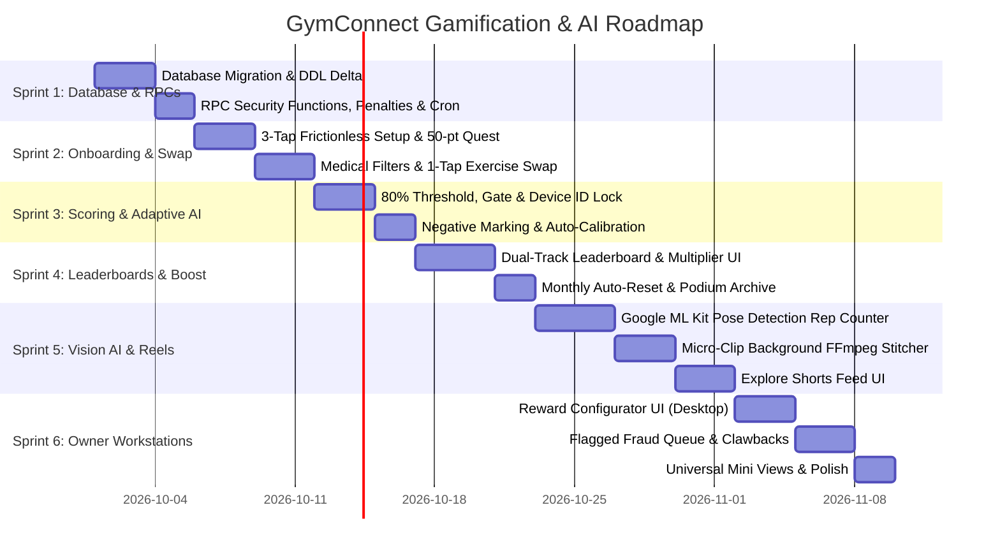

# 🏆 GymConnect Enterprise SaaS — Gamification, Vision AI & Anti-Cheat Master Specification & Plan

> **Document Version:** 2.0 (Production Master)  
> **Status:** Architectural Blueprint & Phased Development Roadmap  
> **Target Platforms:** Multi-Tenant Supabase Backend, Flutter Mobile Super App (iOS/Android), Flutter Desktop / Web Workstation (Windows/macOS/Web)  
> **Primary References:** `gamification_rules_v2.md`, `ms.mm.md`, `supabase_schema.sql`, `.rules`, `AGENTS.md`

---

## 1. 🔍 Root-Cause Analysis & Clarification of the 3 Key Features

Aapka sawal bilkul theek hai — yeh teeno points `gamification_rules_v2.md` mein bilkul maujood the:
1. **Line 76:** *"User apne mobile ko stand par rakhega. Humara AI trainer sirf exercise count karega..."* (Pehle plan mein camera recording highlight hui, lekin **Google ML Kit Pose Detection** ka on-device rep counting engine explicitly highlight nahi hua tha).
2. **Line 40–42:** *"Adaptive AI (Auto-Calibration): 3 din musalsal 10k steps miss hone par system automatically target 6k par le aayega..."* (Pehle plan mein UI bullet point tha, lekin **PostgreSQL DDL tracking columns** miss the).
3. **Line 51:** *"GymConnect mein har gym ko apne Top 3 members ko free membership ya reward dena lazmi hoga..."* (Pehle plan mein sirf fixed free membership extend ho rahi thi, jabke gym owner ko **Custom Reward Configurator** chahiye tha).

Neeche is pooray architecture ko aik comprehensive SaaS-grade master plan ke sath document kiya gaya hai jisme database schema, ML Kit vision pipeline, adaptive calibration algorithms, aur desktop configurators shamil hain.

---

## 2. 🗄️ Supabase Multi-Tenant Database Architecture (Full DDL Delta)

Neeche diye gaye tables aur columns live Supabase database mein implement kiye jayenge taake **Zero Mock Data** rule 100% follow ho:

### 2.0 Database Extensions
```sql
CREATE EXTENSION IF NOT EXISTS pg_cron;
```

### 2.1 Tenants Table: Reward Configurator & Gym Settings (Null-Safe)
Har gym owner apne gym ke mutabiq custom rewards define kar sakega:
```sql
ALTER TABLE IF EXISTS tenants
ADD COLUMN IF NOT EXISTS leaderboard_rewards JSONB NOT NULL DEFAULT '{
    "rank_1": {"title": "1-Month Free Access", "type": "membership_extension", "value": 30},
    "rank_2": {"title": "50% Off Next Renewal", "type": "discount_voucher", "value": 50},
    "rank_3": {"title": "Free Whey Shaker & Tub", "type": "custom_reward", "value": "merch"}
}'::jsonb,
ADD COLUMN IF NOT EXISTS min_monthly_workouts_qualification INT DEFAULT 18,
ADD COLUMN IF NOT EXISTS veteran_multiplier_config JSONB NOT NULL DEFAULT '{
    "tier_1_days": 14, "tier_1_multiplier": 1.10,
    "tier_2_days": 30, "tier_2_multiplier": 1.25,
    "tier_3_days": 60, "tier_3_multiplier": 1.50
}'::jsonb;
```

### 2.2 User Fitness Profiles: Track A/B Routing, Adaptive AI & Medical Filters
```sql
ALTER TABLE IF EXISTS profiles
ADD COLUMN IF NOT EXISTS primary_device_id VARCHAR(255),
ADD COLUMN IF NOT EXISTS device_locked_at TIMESTAMPTZ,
ADD COLUMN IF NOT EXISTS device_model_info VARCHAR(150);

ALTER TABLE IF EXISTS user_fitness_profiles
ADD COLUMN IF NOT EXISTS assigned_workout_track VARCHAR(50) DEFAULT 'track_a' CHECK (assigned_workout_track IN ('track_a', 'track_b')),
ADD COLUMN IF NOT EXISTS current_step_target INT DEFAULT 10000,
ADD COLUMN IF NOT EXISTS base_step_target INT DEFAULT 10000,
ADD COLUMN IF NOT EXISTS consecutive_target_misses INT DEFAULT 0,
ADD COLUMN IF NOT EXISTS last_auto_calibrated_at TIMESTAMPTZ,
ADD COLUMN IF NOT EXISTS medical_injuries TEXT[] DEFAULT '{}',
ADD COLUMN IF NOT EXISTS profile_completed BOOLEAN DEFAULT FALSE,
ADD COLUMN IF NOT EXISTS onboarded_at TIMESTAMPTZ DEFAULT NOW();
```

### 2.3 Exercises Library: Contraindications & Swap Matrix
```sql
ALTER TABLE IF EXISTS exercises
ADD COLUMN IF NOT EXISTS contraindicated_injuries TEXT[] DEFAULT '{}',
ADD COLUMN IF NOT EXISTS swap_group_id VARCHAR(100), -- E.g. 'quad_compound', 'chest_press'
ADD COLUMN IF NOT EXISTS ml_pose_exercise_type VARCHAR(50); -- 'squat', 'pushup', 'bicep_curl', 'pullup'
```

### 2.4 Member Gamification: Monthly Resets, Multipliers & Penalty Tracking
```sql
ALTER TABLE IF EXISTS member_gamification
ADD COLUMN IF NOT EXISTS monthly_points INT DEFAULT 0,
ADD COLUMN IF NOT EXISTS monthly_workouts_completed INT DEFAULT 0,
ADD COLUMN IF NOT EXISTS streak_multiplier NUMERIC(3, 2) DEFAULT 1.00,
ADD COLUMN IF NOT EXISTS is_elite_qualified BOOLEAN DEFAULT FALSE,
ADD COLUMN IF NOT EXISTS last_month_rank INT,
ADD COLUMN IF NOT EXISTS total_penalties_count INT DEFAULT 0,
ADD COLUMN IF NOT EXISTS last_penalty_date DATE;
```

### 2.5 New Table: Daily 80% Threshold Task Audit & Penalties (`daily_gamification_logs`)
Daily streak protect karne, points allocate karne aur **-10 negative penalty** track karne ka central audit table:
```sql
CREATE TABLE IF NOT EXISTS daily_gamification_logs (
    id UUID PRIMARY KEY DEFAULT gen_random_uuid(),
    tenant_id UUID NOT NULL REFERENCES tenants(id) ON DELETE CASCADE,
    user_id UUID NOT NULL REFERENCES profiles(id) ON DELETE CASCADE,
    log_date DATE NOT NULL DEFAULT CURRENT_DATE,
    device_id_used VARCHAR(255),
    workout_assigned_sets INT DEFAULT 0,
    workout_completed_sets INT DEFAULT 0,
    workout_completion_pct NUMERIC(5, 2) DEFAULT 0.00,
    step_target INT DEFAULT 10000,
    step_actual INT DEFAULT 0,
    step_completion_pct NUMERIC(5, 2) DEFAULT 0.00,
    diet_logged_type VARCHAR(20) DEFAULT 'none', -- 'photo_proof', 'self_check', 'none'
    diet_proof_url TEXT,
    sleep_logged_hours NUMERIC(4, 1) DEFAULT 0.0,
    sleep_source VARCHAR(50) DEFAULT 'none', -- 'healthkit', 'health_connect', 'manual', 'none'
    sleep_asleep_minutes INT DEFAULT 0,
    gate_checkin_verified BOOLEAN DEFAULT FALSE,
    composite_completion_pct NUMERIC(5, 2) DEFAULT 0.00,
    points_awarded INT DEFAULT 0,
    penalty_deducted INT DEFAULT 0, -- -10 points for unexcused absence
    is_unexcused_absence BOOLEAN DEFAULT FALSE,
    streak_saved BOOLEAN DEFAULT FALSE,
    created_at TIMESTAMPTZ DEFAULT NOW(),
    CONSTRAINT uq_daily_user_gamification UNIQUE (user_id, log_date)
);
```

### 2.6 New Table: Video Micro-Clips & Explore Feed (`member_workout_reels`)
```sql
CREATE TABLE IF NOT EXISTS member_workout_reels (
    id UUID PRIMARY KEY DEFAULT gen_random_uuid(),
    tenant_id UUID NOT NULL REFERENCES tenants(id) ON DELETE CASCADE,
    user_id UUID NOT NULL REFERENCES profiles(id) ON DELETE CASCADE,
    video_url TEXT NOT NULL,
    thumbnail_url TEXT,
    duration_seconds INT NOT NULL,
    routine_title VARCHAR(150),
    streak_days_at_record INT DEFAULT 0,
    is_public_explore BOOLEAN DEFAULT TRUE,
    is_flagged BOOLEAN DEFAULT FALSE,
    likes_count INT DEFAULT 0,
    created_at TIMESTAMPTZ DEFAULT NOW()
);
```

### 2.7 New Table: Monthly Leaderboard Podium Archives & Automated Reward Fulfillment (`monthly_leaderboard_archives`)
```sql
CREATE TABLE IF NOT EXISTS monthly_leaderboard_archives (
    id UUID PRIMARY KEY DEFAULT gen_random_uuid(),
    tenant_id UUID NOT NULL REFERENCES tenants(id) ON DELETE CASCADE,
    month_year VARCHAR(7) NOT NULL, -- '2026-09'
    podium_rank INT NOT NULL, -- 1, 2, 3
    user_id UUID NOT NULL REFERENCES profiles(id) ON DELETE CASCADE,
    points_scored INT NOT NULL,
    streak_at_finish INT NOT NULL,
    reward_title VARCHAR(255) NOT NULL,
    reward_type VARCHAR(50) NOT NULL, -- 'membership_extension', 'discount_voucher', 'custom_reward'
    reward_value INT DEFAULT 30, -- Days extended or discount percentage
    is_fulfilled BOOLEAN DEFAULT FALSE, -- Automatically marked TRUE by fulfillment RPC
    subscription_id_extended UUID REFERENCES member_subscriptions(id) ON DELETE SET NULL,
    invoice_id_generated UUID REFERENCES invoices(id) ON DELETE SET NULL,
    fulfilled_at TIMESTAMPTZ,
    created_at TIMESTAMPTZ DEFAULT NOW(),
    CONSTRAINT uq_month_podium UNIQUE (tenant_id, month_year, podium_rank)
);
```

### 2.8 New Table: Owner Flagged Verification Queue (`gamification_flagged_queue`)
```sql
CREATE TABLE IF NOT EXISTS gamification_flagged_queue (
    id UUID PRIMARY KEY DEFAULT gen_random_uuid(),
    tenant_id UUID NOT NULL REFERENCES tenants(id) ON DELETE CASCADE,
    user_id UUID NOT NULL REFERENCES profiles(id) ON DELETE CASCADE,
    proof_type VARCHAR(50) NOT NULL, -- 'diet_photo', 'workout_video', 'manual_steps'
    proof_url TEXT NOT NULL,
    points_awarded INT NOT NULL,
    status VARCHAR(20) DEFAULT 'pending_review', -- 'pending_review', 'approved', 'deducted'
    flagged_reason TEXT,
    reviewed_by UUID REFERENCES profiles(id) ON DELETE SET NULL,
    reviewed_at TIMESTAMPTZ,
    created_at TIMESTAMPTZ DEFAULT NOW()
);
```

---

## 3. 🧠 Deep Architectural Systems Breakdown

### System A: Google ML Kit On-Device Vision AI (Hands-Free Auto Rep Counter)
*   **Problem:** User heavy bench press ya squats karte waqt har set ke baad phone screen touch nahi kar sakta (chalk lagta hai, concentration toot'ti hai).
*   **ML Kit Architecture:**
    1. Phone stands on tripod / gym bench facing the member.
    2. Camera stream connects directly to `google_mlkit_pose_detection` (Accurate or Base model running on-device Neural Processing Unit / GPU).
    3. **Joint Angle Biomechanics State Machine:**
       * **Squats:** Tracks Hip-Knee-Ankle angle ($\theta$). Infers `DOWN` when $\theta < 90^\circ$, `UP` when $\theta > 165^\circ$.
       * **Bicep Curls:** Tracks Shoulder-Elbow-Wrist angle.
       * **Pushups / Bench Press:** Tracks Elbow flexion and Chest depth.
    4. **Smart Rep Counter:** Jab state `DOWN -> UP` complete hoti hai, phone subtle voice beep / haptic feedback deta hai aur active set count auto-increment ho jata hai.
    5. **Micro-Clip Recording Sync:** Jab rep counter start hota hai, camera automatically set ka pehla **5–10 second clip** background cache mein save kar leta hai bina storage aur battery drain kiye.

### System B: Adaptive AI Habit Auto-Calibration Engine
*   **Problem:** Static targets frustrates users. Agar 10,000 steps continuous miss hon toh banda app delete kar deta hai.
*   **Backend & App Logic:**
    1. Daily cron / step sync evaluate karta hai: `IF step_actual < (current_step_target * 0.70)`.
    2. Agar step target miss hua: `consecutive_target_misses = consecutive_target_misses + 1`.
    3. **Auto-Calibration Trigger:**
       ```sql
       IF consecutive_target_misses >= 3 THEN
           -- Reduce target by 30% to re-engage momentum
           NEW_TARGET := GREATEST(5000, current_step_target - 2000);
           UPDATE user_fitness_profiles 
           SET current_step_target = NEW_TARGET, 
               consecutive_target_misses = 0,
               last_auto_calibrated_at = NOW()
           WHERE user_id = :user_id;
       END IF;
       ```
    4. **Frontend Adaptive Modal:** Mobile app displays an empathetic coach dialog:
       *"We noticed this week was demanding! Your AI coach calibrated your target to 6,000 steps so you maintain your daily streak without burning out. Keep crushing it!"*

### System C: Gym Owner's Dynamic Reward Configurator
*   **Problem:** Har gym ka business model alag hota hai. Koi gym free month deta hai, koi branded protein shake ya 50% discount deta hai.
*   **Desktop Workstation Architecture:**
    1. Located inside **Owner Workstation -> Settings & Gamification Rules**.
    2. Form fields for Podium Rewards:
       * **Rank 1 Reward:** Title (e.g. *"1 Month Free All-Access Pass"*), Type (Membership Extension / Merch / Cash Voucher), Value.
       * **Rank 2 Reward:** Title (e.g. *"50% Off Next Month + Free Shaker"*).
       * **Rank 3 Reward:** Title (e.g. *"Free Titan Whey Protein 2kg"*).
       * **Qualification Gate:** Minimum Workouts Required in Month (Default: 18).
    3. Auto-Saves to Supabase `tenants.leaderboard_rewards`.
    4. **Live App Reflection:** Member app ke [GymLeaderboardSheet](file:///d:/gym/gym_connect_app/lib/features/workout/presentation/widgets/gym_leaderboard_sheet.dart) par owner ke configured rewards dynamic podium banners ke roop mein showcase honge.

### System D: Anti-Cheat Hardware Gate Lock & Device ID Binding
*   **Problem:** Fake home check-ins, spoofed locations, ya aik dost ke mobile mein doosre dost ka account login kar ke attendance lagwana (account sharing fraud).
*   **Execution & Device Signature Lock:**
    1. **Initial Device Binding:** Jab member pehli martaba login karta hai, phone ka unique hardware UUID `profiles.primary_device_id` aur `device_locked_at` par lock ho jata hai.
    2. **Anti-Sharing Enforcement:** Jab member gym ke gate pass (`GatePassCard` rolling 10s token) ko access karega, app verify karegi:
       ```dart
       if (currentHardwareDeviceId != profile.primaryDeviceId) {
           throw SecurityException("Device Mismatch: Account is locked to registered device. Reception contact karein.");
       }
       ```
    3. **Gate Physical Check-In Interlock:** Before `points_awarded` are credited to `member_gamification`, backend function `rpc_submit_daily_task` queries:
       ```sql
       SELECT EXISTS (
           SELECT 1 FROM attendance_logs 
           WHERE member_id = :user_id 
             AND tenant_id = :tenant_id 
             AND check_in_time::DATE = CURRENT_DATE 
             AND access_result = 'granted'
       );
       ```
    4. Agar physical gate check-in nahi hua, app workout logs aur sets save karegi lekin points unlock nahi honge jab tak din khatam hone se pehle gym gate scan na ho jaye.

### System E: Negative Marking & Penalty Engine (-10 Points)
*   **Problem:** Members informing ke baghair continuous gym miss karte hain, ya tasks chor kar cheating karte hain.
*   **Execution (Daily Midnight Cron & Penalty RPC):**
    1. **Scheduled Evaluation:** Rozana raat 11:59 PM par automated pg_cron job `rpc_daily_midnight_audit()` run hogi.
    2. **Active Member Check:** Har us active enrolled member ke liye jiska:
       - Aaj rest day schedule nahi tha,
       - Koi approved membership freeze ya leave notice system mein nahi tha,
       - Aur `attendance_logs` mein valid gate check-in darj nahi hua:
    3. **Penalty Execution:**
       - `member_gamification.monthly_points = GREATEST(0, monthly_points - 10)`
       - `member_gamification.total_points = GREATEST(0, total_points - 10)`
       - `member_gamification.current_streak_days = 0` (Streak breaks immediately)
       - `member_gamification.total_penalties_count = total_penalties_count + 1`
       - `daily_gamification_logs` mein `penalty_deducted = 10` aur `is_unexcused_absence = TRUE` record hoga.
    4. **In-App Penalty Alert:** Subah app open karne par warning toast show hoga: *"Unexcused Gym Absence: -10 Points Penalty Applied & Streak Reset. Keep consistent to protect your monthly rank!"*

> [!TIP]
> ### 💡 Senior Architect Pro-Tip: The Vacation / Sick Leave & Freeze Shield
> Jab backend mein `rpc_daily_midnight_audit()` implement kiya jaye, toh query ke andar app ke existing `member_subscriptions` table ke freeze fields ko lazmi check karna hai:
> ```sql
> -- Excused Exemption Check:
> EXISTS (
>     SELECT 1 FROM member_subscriptions ms
>     WHERE ms.member_id = p.id
>       AND (
>           ms.status = 'frozen' 
>           OR (CURRENT_DATE BETWEEN ms.freeze_start_date AND ms.freeze_end_date)
>       )
> )
> ```
> **Behavior:** Agar member ne [FreezeMembershipDialog](file:///d:/gym/gym_connect_app/lib/features/members/presentation/widgets/freeze_membership_dialog.dart) ke zariye legit medical leave ya out-of-city travel ki waja se subscription freeze karwai hui hai:
> 1. Un par koi **-10 Points Penalty apply nahi hogi**.
> 2. Unki continuous streak tooti nahi samjhi jayegi, balki **Freeze / Pause Mode** mein chali jayegi (unbroken preservation).
> 3. Daily audit log mein `is_unexcused_absence = FALSE` aur `notes = 'Membership Frozen (Medical/Travel)'` darj hoga.

### System F: Generative AI Workout Engine (The Brain — Supabase Edge Function + Structured LLM Pipeline)
*   **Problem:** User ke unique body type, goal, aur injuries ke mutabiq dynamic 90-day hyper-personalized workout routine banayega kaun aur kaise?
*   **Cloud Architecture & Execution Flow:**
    1. **Trigger:** Jab user Onboarding complete karta hai ya protocol recalibrate karta hai, Flutter app Supabase Edge Function `generate-ai-workout` ko trigger karti hai.
    2. **Payload Context Extraction & Silent BMI Routing:**
       - Edge Function backend database se profile details fetch karti hai (`current_weight_kg`, `height_cm`, `age`, `fitness_goal`, `experience_level`).
       - **Silent BMI & Track Routing:** System backend par silently BMI calculate karta hai. Agar user overweight/obese category mein fall kare (Weight $\ge 90\text{kg}$ ya $\text{BMI} \ge 28$ with beginner level), toh system prompt automatically **Track B (Low-Impact Beginner Progression)** trigger karta hai.
       - **Track B Rule:** High-impact plyometrics (jumping squats, box jumps, burpees) aur heavy spinal compression movements strict filter out honge. Joint-friendly cardio, machine-assisted exercises, aur high-retention gradual progression assign hogi taake member injury ya muscle soreness ki waja se gym na chore (churn reduction).
       - Excluded injuries list from `user_fitness_profiles.medical_injuries` (e.g. `['knee_pain', 'lower_back']`).
       - Gym's active exercise catalog from `exercises` table (names, target muscles, equipment available).
    3. **LLM Orchestration with Strict JSON Schema:**
       - Calls OpenAI GPT-4o-mini / Gemini Flash API with `response_format: { type: "json_object" }`.
       - System prompt enforces sports science splits (Track A: Push/Pull/Legs for Hypertrophy, High-Rep Circuit for Fat Loss, Calisthenics Progression for Athletic V-Taper; Track B: Low-Impact High-Retention Beginner Circuit).
       - **Strict Constraint:** LLM sirf database mein maujood exercise IDs / names return kar sakti hai. Hallucinated ya dangerous exercises (matching user's injury contraindications) automatically sanitize ho jati hain.
    4. **Atomic Database Ingestion:**
       - Edge Function atomic database transaction chalati hai:
         - Creates parent `workout_routines` record (`is_ai_generated = TRUE`).
         - Inserts 90 daily routines into `workout_routine_days`.
         - Maps grouped exercises, target sets, reps, and rest timers into `workout_day_exercises`.
    5. **Offline-First Synchronization:** App locally routine cache kar leti hai taake basement gyms mein internet slow hone par bhi routine 100% smooth chale.

### System G: Native OS Sleep Auto-Sync Engine (Apple HealthKit & Android Health Connect)
*   **Problem:** Sleep tracking ko agar manual rakha jaye toh log fake 8 hours likh kar free points le lete hain.
*   **Native OS Hardware Integration:**
    1. **OS Sensor Permissions:** Flutter `health` package ke zariye native OS health bridges connect kiye jayenge:
       - **iOS:** `HKCategoryTypeIdentifierSleepAnalysis` (Apple HealthKit) reading Apple Watch & iPhone bed-time sensors.
       - **Android 14+:** `SleepSessionRecord` via official Android Health Connect API (reading WearOS, Samsung Health, Google Pixel Watch).
    2. **Morning Auto-Sync Service (`SleepTrackerService`):**
       - Rozana subah jab member app open karta hai, background sync service guzishta raat ke 12-hour window (8:00 PM to 8:00 AM) ko query karti hai.
       - Actual sleep stages (Deep Sleep + REM + Light Sleep) aggregate ho kar `sleep_asleep_minutes` calculate karte hain.
    3. **Weighted Scoring & Anti-Cheat Differentiation:**
       - **Auto-Synced Verified Sensor Sleep ($\ge 7$ Hours):** Full `+10 Points` credit.
       - **Auto-Synced Verified Sensor Sleep (5–7 Hours):** `+7 Points` credit.
       - **Manual Self-Report Fallback:** Agar kisi ke paas smartwatch ya sleep tracker nahi hai aur wo manually enter kare, toh strictly capped at **Max `+3 Points`** taake leaderboard par koi fake sleep enter kar ke top par na aa sake.
    4. **Audit Persistence:** Data directly `daily_gamification_logs` mein `sleep_source = 'healthkit' / 'health_connect' / 'manual'` ke sath persist hota hai.

### System H: Automated Month-End Reward Fulfillment Engine (`rpc_execute_automated_reward_distribution`)
*   **Problem:** Har mahine ke aakhir par gym owner bhool jata hai ke kisko free month dena tha, jisse members demotivate hote hain aur trust kharab hota hai.
*   **Zero-Touch Automated Execution Architecture:**
    1. **pg_cron Monthly Trigger:** Har mahine ki 1st tareekh ko 00:00:00 UTC par `rpc_monthly_leaderboard_reset()` run hoti hai.
    2. **Qualification & Winner Evaluation:**
       - Database scan karti hai Top 3 members ko jinhone baseline `min_monthly_workouts_qualification` (e.g. $\ge 18$ workouts) poora kiya ho.
       - Tenant ke configured rewards `tenants.leaderboard_rewards` se load hote hain.
    3. **Instant Database Subscription Extension (Zero Manual Touch):**
       - Agar Rank 1 ka prize `"membership_extension"` (Value: 30 Days) hai:
         ```sql
         UPDATE member_subscriptions
         SET end_date = GREATEST(end_date, CURRENT_DATE) + INTERVAL '30 days',
             status = 'active',
             updated_at = NOW()
         WHERE member_id = winner_record.user_id 
           AND tenant_id = winner_record.tenant_id;
         ```
       - System automatically POS billing table `invoices` mein Rs. 0 ki official paid invoice create karega:
         `total_amount = 0.00`, `status = 'paid'`, `notes = '1st Place Leaderboard Prize: 1-Month Free Access Granted Automatically'`.
       - Is se gym owner ke financial shift reports aur Z-Reports mein koi error ya missing data nahi aayega.
    4. **Digital Prize Vault & Counter Pickup Voucher:**
       - Agar reward merchandise ya store discount hai (e.g. Free Protein Shaker ya Tub), system automatically `store_orders` mein Rs. 0 balance ka pickup order create kar ke 6-digit pickup token (`#REWARD-XXXX`) generate karega.
    5. **Audit History & Push Notification:**
       - Record `monthly_leaderboard_archives` mein `is_fulfilled = TRUE`, `fulfilled_at = NOW()` ke sath lock ho jayega.
       - Winner ke phone par hero victory push alert trigger hoga:
         *"🏆 CONGRATULATIONS CHAMPION! You finished #1 this month! Your 1-Month Free Gym Access has been automatically credited to your account. Enjoy your reward!"*

---

## 4. 📅 Phase-by-Phase SaaS Implementation Roadmap



---

### 🔹 Sprint 1: Multi-Tenant Backend Schema, RPCs & Automated Reward Fulfillment
*   **Deliverables:**
    1. PostgreSQL migration script applying all schema alterations to `profiles`, `tenants`, `user_fitness_profiles`, `exercises`, `member_gamification`, `daily_gamification_logs`, `member_workout_reels`, `gamification_flagged_queue`, and `monthly_leaderboard_archives`.
    2. `rpc_submit_daily_activity()`: Validates 80% threshold rule, checks gate attendance in `attendance_logs`, evaluates photo proof vs tick, checks sleep source, and credits weighted points.
    3. `rpc_daily_midnight_audit()`: Midnight pg_cron job scanning unexcused gym absences, exempting members with approved `member_subscriptions` freezes (medical/travel/sick leave), applying **-10 points penalty** to unexcused absences, breaking streak, and logging audit entries.
    4. `rpc_monthly_leaderboard_reset()` & Automated Fulfillment: Scheduled on 1st of every month via pg_cron. Writes top 3 winners to `monthly_leaderboard_archives`, **automatically extends `member_subscriptions` by 30 days** for Rank 1/2 winners, generates official Rs. 0 reconciliation invoices in `invoices`, clears `monthly_points`, and calculates veteran `streak_multiplier`.
    5. Row-Level Security (RLS) policies for all new tables ensuring complete tenant isolation.

---

### 🔹 Sprint 2: Generative AI Workout Engine, Progressive Onboarding & The "Swap" Feature
*   **Deliverables:**
    1. **Generative AI Workout Brain (Supabase Edge Function `generate-ai-workout`):**
       - Edge function calling OpenAI GPT-4o-mini / Gemini Flash with strict JSON schema.
       - **Silent BMI & Track Routing:** Computes BMI from user's Weight/Height/Age. If user is overweight/obese (Weight $\ge 90\text{kg}$ ya $\text{BMI} \ge 28$ with beginner status), automatically triggers **Track B (Low-Impact Beginner Retention Track)** with joint-friendly exercises, purging high-impact plyometrics to prevent churn.
       - Synthesizes 90-day protocol mapped strictly to the gym's active catalog (`exercises` table).
       - Automatically purges exercises conflicting with member's `medical_injuries`.
       - Inserts atomically into `workout_routines`, `workout_routine_days`, and `workout_day_exercises`.
    2. **Rapid 3-Question Onboarding Sheet & Track Switcher:** On initial install, asks only Current Weight, Target Goal (Lean / V-Shape / Heavyweight), and Age. The "Current Weight" serves as the direct algorithmic switch between Track A (Dynamic Splits) and Track B (Beginner Low-Impact). Immediately unlocks Home Shell.
    3. **Gamified 50-Points Profile Quest Card:** Sticky glowing card on Member Today tab: *"Complete your body dimensions & health profile to unlock AI Trainer & claim 50 Bonus Points!"*.
    4. **Medical Injury Matrix:** Multi-select injury dialog (Knees, Lower Back, Shoulder). Filter logic automatically omits contraindicated exercises from generated daily routines.
    5. **1-Tap Exercise & Diet Swap:** If machine is occupied or food allergic, member taps "Swap Exercise" -> System provides equivalent compound/isolation movement from `swap_group_id` with zero point deduction.

---

### 🔹 Sprint 3: The 80% Threshold Calculation, Sleep Sensor Auto-Sync, Gate Lock & Adaptive AI
*   **Deliverables:**
    1. **Native OS Sleep Auto-Sync Engine (`SleepTrackerService`):**
       - Connects to Apple HealthKit (`HKCategoryTypeIdentifierSleepAnalysis`) & Android Health Connect (`SleepSessionRecord`).
       - Auto-syncs verified sleep duration: $\ge 7$ hours = full `+10 pts`, 5–7 hours = `+7 pts`.
       - Manual self-report fallback strictly capped at `+3 pts` (anti-cheat protection).
    2. **Scoring Engine Provider:**
       * Workout Sets Completion: Up to `+50 pts`
       * Auto-Synced Steps (HealthKit/Google Fit): `+20 pts` (Manual: `+5 pts`)
       * Diet Photo Proof: `+15 pts` (Plain checkbox: `+2 pts`)
       * Sleep Log: Up to `+10 pts` (Verified sensor) vs `+3 pts` (Manual)
       * **Unexcused Absence Penalty:** `-10 pts` & streak break if gym is missed without prior notification.
    3. **Device ID Anti-Share Lock:** Binding member account to `profiles.primary_device_id`. Blocks gate pass QR rolling generation if attempted from an unauthorized device.
    4. **Anti-Cheat Gate Interlock:** Blocks daily streak save if `attendance_logs` has no verified physical check-in for the member on that date.
    5. **80% Composite Threshold Engine:** Streak increments ONLY if total daily weighted score $\ge 80\%$ and gate check-in is verified.
    6. **Adaptive AI Calibration Provider:** Tracks 3 consecutive misses in `daily_step_logs` / `consecutive_target_misses` and drops target automatically with an empathetic re-engagement popup.

---

### 🔹 Sprint 4: Dual-Track Leaderboard, Monthly Resets & Veteran Multiplier
*   **Deliverables:**
    1. **Dual-Track Toggle on Leaderboard Sheet:**
       * **Monthly Race (`monthly_points`):** Resets to 0 on 1st of month. New members have equal opportunity to reach Top 3.
       * **Hall of Fame (`current_streak_days`):** Lifetime unbroken gym streak. Never resets unless missed without authorization.
    2. **Veteran Streak Multiplier Engine:** Veteran members with long unbroken streaks receive real-time point boosts ($1.1\times - 1.5\times$) so their loyalty is rewarded during monthly races.
    3. **Baseline Qualification Indicator:** Shows monthly workout progress (e.g., `14/18 Workouts Completed — 4 More to Qualify for Top 3 Rewards`).
    4. **Dual-View Standard:** Grid View (podium cards with medals) and List View (high-density sorting with search).

---

### 🔹 Sprint 5: Google ML Kit Auto Rep Counting, Micro-Clips & Explore Feed
*   **Deliverables:**
    1. **Google ML Kit Pose Detection Integration:**
       * Camera preview widget in Workout Active mode.
       * Pose biomechanics state machine for Squats, Pushups, Curls, and Pull-ups.
       * Hands-free automatic rep increment with audio/haptic cues.
    2. **Smart Micro-Clip Background Recorder:**
       * Auto-captures 5–10s of Set 1 for each exercise.
       * Native background FFmpeg utility stitches clips into a clean 60–90 second daily highlight video with gym logo watermark.
    3. **The Explore Feed (Shorts / Reels Tab):**
       * Full-screen vertical swipeable video player.
       * Displays member handle, current streak badge, and workout split title.
       * Member privacy toggle: Option to keep workout videos private or publish to gym explore feed.

---

### 🔹 Sprint 6: Gym Owner Desktop Workstations & Universal Mini Views
*   **Deliverables:**
    1. **Gym Owner Reward Configurator (Desktop):**
       * Inside Owner Settings: Dedicated UI to customize 1st, 2nd, and 3rd rank prizes (e.g. Free Month, Supplement Shaker, Discount) and set qualification workout targets.
       * **Automated Fulfillment Ledger:** Live table showing past winners and their auto-extended subscription dates and generated Rs. 0 receipts.
       * Instant real-time sync with mobile member leaderboard.
    2. **Flagged Fraud Verification & Clawback Workstation:**
       * Dedicated moderation queue where gym owner reviews suspicious meal photos (e.g. photo of a wall) or manual step overrides.
       * 1-Tap "Approve" or "Reject & Clawback Points" with pre-set audit notes.
    3. **Universal Mini View Standard (Strict Rule 7):**
       * Live scaled mini-previews for Reward Configurator, Flagged Review Queue, Leaderboard Sheet, and Explore Reel viewer for navigation hover tooltips and bento dashboard cards.

---

## 5. 🛡️ Verification & Strict Compliance Checklist

| Rule | Requirement | Verification Strategy in This Plan |
| :--- | :--- | :--- |
| **Rule 1** | **Zero Hardcoded Fake Data** | All points, reels, rewards, and steps read/write to Supabase tables. Empty states handled gracefully. |
| **Rule 2** | **Dark Theme & Typography** | `#09090B` scaffold, `#18181B` surface cards, `Oswald` headings, `Inter` body text. |
| **Rule 4** | **Platform Separation** | Heavy ML Kit & camera features on Mobile; Heavy Reward Configuration & Moderation on Desktop. |
| **Rule 5** | **Dual-View Standard** | Both Leaderboard and Moderation queues support Grid and List views with toggle. |
| **Rule 6** | **Runtime Dynamic Theme Accent** | All accents resolved via `Theme.of(context).colorScheme.primary` / `AppColors.accent(context)`. |
| **Rule 7** | **Universal Mini View Standard** | Every screen & dialog includes a live scaled mini-view component. |
| **Rule 8** | **Full-Stack Vertical Slice & Pending Tracker** | Every module is built Database $\rightarrow$ Backend/RPC $\rightarrow$ Riverpod Data Layer $\rightarrow$ UI. Any pending backend task is immediately escalated and tracked. |
